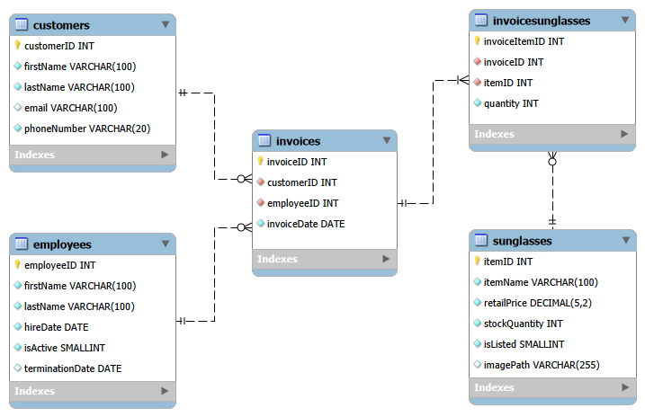
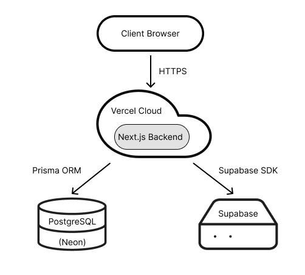

# Sunglasses Management System

## Overview

A full stack product management application designed to track customers, employees, inventory, and invoices. 
This project showcases data modeling integrity, relational constraints, and production pipeline execution.

The system implements automated backup mechanics, live health monitoring, and defensive cascade handling. 
Built for high volume operations, it ensures zero transaction loss and precise data consistency across the schema.

### **Live Application:** [sunglasses-management-system.vercel.app](https://sunglasses-management-system.vercel.app)

## Features

#### 1. State Save and Reset
* Backs up active tables to database branch before initializing a clean, seeded state.

#### 2. Database Rollback
* Captures and maintains the last 5 operational database states for point-in-time recovery.

#### 3. Connection Status
* Visual UI badge displaying active database connection stability in real time.

#### 4. Form Validation
* Strict type-checked entry points for onboarding personnel, customers, and stock.

## Database Schema

## Database Logic

* **Tables:** `Customers`, `Employees`, `Invoices`, `Sunglasses`, and `InvoiceSunglasses`(M:M)

* **Duplicate Protection:** Uses composite unique constraints to block duplications.

* **Database Integrity:** `onDelete: Restrict` prevents deletions linked to transaction records.

* **Automated Cascade:** `onDelete: Cascade` purges line items if parent invoice is removed.

## System Architecture  

| Layer | Technology |
| :--- | :--- |
| **Framework** | Next.js (React & API Routes) |
| **Styling** | Tailwind CSS |
| **Database** | PostgreSQL (Neon) |
| **ORM** | Prisma |
| **Storage** | Supabase Objects |
| **Hosting** | Vercel Cloud |

## Citations

All codebase architecture, database design, and implementation work belong entirely to me.
AI tools were used in a limited support role for schema queries, structural debugging assistance, and documentation support.

